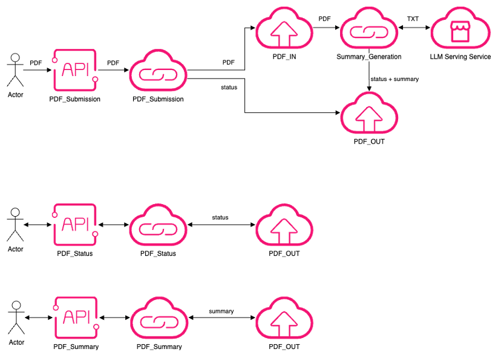

# OTC_PDF_summary
# Building an Asynchronous PDF Summarization Service with API Gateway and FunctionGraph on OTC

# Introduction
Recently, a customer approached us with a question:
**"Can Open Telekom Cloud (OTC) offer an API Gateway that allows clients to submit a PDF and receive a summary in return?"**
It sounded simple on the surface—but as with many cloud-native solutions, the real challenge lay beneath. I quickly discovered that the LLM (Large Language Model) I used to generate summaries often took longer than the API Gateway timeout. So I had to design a scalable, asynchronous solution using OTC services like API Gateway, FunctionGraph (FG), Object Storage Service (OBS), and an LLM service from the OTC Marketplace.
Let me walk you through my solution.
* * *

# Business Requirements
The customer wanted:
*   A REST API to upload a PDF and receive a summary.
    
*   A system that handles PDF files.
    
*   A solution that can deal with long-running LLM summarization tasks.
    
*   Stateless interaction via three simple API endpoints.
    
* * *

# Architecture Overview
To meet the requirements, I built an **asynchronous, event-driven architecture** using the following OTC services:

**Components Used**

*   **API Gateway**: Exposes public RESTful APIs.
    
*   **OBS**: Stores uploaded PDFs, results and processing status.
    
*   **FG**: Handles compute logic in a serverless manner.
    
*   **OTC Marketplace LLM Service**: Processes the PDF text and returns a summary.
    
* * *

# API Endpoints
I defined three endpoints via **API Gateway**:
1.  **POST /** **PDF_Submission**  
    Upload a PDF. Returns a job ID for tracking.
    
2.  **GET / PDF_Status {task_id}**  
    Check if the summarization is completed.
    
3.  **GET / PDF_Summary {task_id}**  
    Retrieve the final summary once it's ready.
    
* * *

# Why Async?
Initially, I tried to synchronously generate the summary within a single FG invocation triggered by the API Gateway. However:
*   **LLM inference time exceeded the default timeout for API Gateway (often ~5 seconds).**
    
*   **Processing large documents is inherently time-consuming.**
    
We needed a **non-blocking design**, where users can submit PDFs and fetch results later.

* * *

# Async Workflow Design
Here’s how I transformed the solution into an **event-driven asynchronous flow**:

**1. PDF Submission**
*   **Trigger:** API Gateway → FG PDF_Submission
    
*   **Steps:**
    
    *   Validate and store the PDF in OBS.
        
    *   Generate a task_id.
        
    *   Trigger the **summarization pipeline** via OBS event.
        
**2. Summary Generation**
*   **Trigger:** OBS Event → FG Summary_Generation
    
*   **Steps:**
    
    *   Extracts text from the uploaded PDF.
        
    *   Calls the LLM service to generate a summary.
        
    *   Stores summary in OBS.
        
**3. Status Check**
*   **Trigger:** API Gateway → FG PDF_Status
    
*   **Steps:**
    
    *   Reads status from OBS.
        
    *   Returns the actual status.
        
**4. Summary Fetch**
*   **Trigger:** API Gateway → FG PDF_Summary
    
*   **Steps:**
    
    *   Returns summary from OBS.

* * *

# Benefits of the Async Design
*   **Resilient to LLM inference delays**
    
*   **Scales independently at each stage**
    
*   **User-friendly polling mechanism**
    
*   **Stateless and serverless—low operational burden**
    
* * *

# Diagram

* * *

# PDF Submission

  
 This section contains a detailed explanation of the PDF Submission process, revealed upon expansion. 

As part of our asynchronous PDF summarization design on **OTC**, the **PDF Submission FG** plays a critical role. This function receives a PDF from the client through the **API Gateway**, stores it securely in **OBS**, and generates a unique task ID to track the processing job.

## Overview

**What the PDF Submission FG Does**

*   Validates the incoming API request.
*   Decodes the provided PDF file.
*   Generates a unique task ID.
*   Uploads the PDF to a structured location in OBS.
*   Returns the task ID to the client for further tracking.

**What the API Gateway Does**

*   Listens on HTTPS.
*   Acts as a Trigger for the FG.
*   Forward PDF files to FG.
*   Returns the Task_ID to the client.

**What the OBS Does**

*   Stores Task_IDs and PDF files.
*   Acts as a Trigger for the Summary Generation FG.

## Step by Step Guide

Open OTC Console, make sure on the OBS page that the two buckets available for the original PDF and the summary store. I created the `atokai-pdf-summary-in` and `atokai-pdf-summary-out` buckets for my solution. To create a new function go to FunctionGraph menu. Open Functions/Function list, and click on `_Create Function_`. Choose Create from scratch. Under Basic information, select Event Function, choose your Region, and give a self explanatory name for your function. I named my function to `PDF_Submission`. Because the Function needs to access OBS bucket we need an Agency with OBS OperateAccess Permission Policies. Set the runtime to Python 3.9.

Click Create Function. You will see the Function Info page of your new Function.

First you need to set the API Gateway trigger, click on the `+ Create Trigger` link. Trigger type is API Gateway. If you don’t have an API, you can create one with clicking on the Create API Instance link. I named my API Instance to `atokai_apigw`. The API Name is `API_PDF_Submission`. I also created an API Group, because at the end we will have three APIs. I named my API Group to `API_summarise_pdf_group`. I set the Security Authentication to None, because this will be a short test, and not a live enterprise solution. I left all other settings untouched.

Click on OK. You will see the new API URL on the Configuration/Triggers menu. Make sure that the Method of the API instance is ANY. Let’s continue with the rest of the Configuration. Go to the Environment Variables, and add the `OTC_access_key_id` and `OTC_secret_access_key`, which is the AK/SK of your user, which have OTC Programmatic access. Go to Logs, and enable the log collection to your LTS service.

Go to the Code menu, and edit the `index.py`. You can find my script in the 01-PDF_Submission folder.

## Deploying the Script

Click on "Deploy" to save this script.

## Testing from Client Side

You can find a client script named `01-check_PDF_Submission.py` in the Client Scripts section below. Use this script to test your Function. During testing, the FG logs each execution, which can be viewed under the Monitoring > Logs.

* * *

# Summary Generation

  
 This section contains a detailed explanation of the Summary Generation process, revealed upon expansion. 

As part of our asynchronous PDF summarization design on **OTC**, the **Summary Generation FG** makes the most longest task within the workflow. It starts, when a new file saved on the **OBS**, then using the **LLM-Serving-Service (LLMservice)** from the Open Telekom Cloud Marketplace to generate the summary of the uploaded PDF.

## Overview

**What the Summary Generation FG Does**

*   Gets the unique task ID.
*   Gets the uploaded PDF file.
*   Extracts PDF to TXT.
*   Calls LLMservice.
*   Saves summary to the OBS.

**What the OBS Does**

*   First, OBS stores Task_IDs and PDF files.
*   Second, OBS stores Task_IDs, status information, and summaries.

**What the LLMservice Does**

*   Provides different LLM languages.
*   As a PaaS service paid by token usage.

## Step by Step Guide

Open OTC Console, make sure on the OBS page that the two buckets available for the original PDF and the summary store. I created the _atokai-pdf-summary-in_ and _atokai-pdf-summary-out_ buckets for my solution. To create a new function go to FunctionGraph menu. Open Functions/Function list, and click on _Create Function._ Choose Create from scratch. Under Basic information, select Event Function, choose your Region, and give a self explanatory name for your function. I named my function to `Summary_Generation`. Because the Function needs to access OBS bucket we need an Agency with OBS OperateAccess Permission Policies. Set the runtime to Python 3.9.

Click Create Function. You will see the Function Info page of your new Function.

First you need to set the trigger, click on the _+ Create Trigger_ link. Trigger type is OBS, the Bucket Name is the _atokai-pdf-summary-in_.The rest of the settings could be the default. Tick the Recursive Invocation agreement, and click OK.

Let’s continue with the rest of the Configuration. Go to the Environment Variables, and add the OTC_access_key_id and OTC_secret_access_key, which is the AK/SK of your user, which have OTC Programmatic access. You also need to add the LLMservice’s URL and API key informations, so add the BASE_URL and OPENAI_API_KEY to the Environment Variables. You can order the LLM-Serving-Service on the **Open Telekom Marketplace (Marketplace): https://www.marketplace.otc.t-systems.com.**

Go to Logs, and enable the log collection to your LTS service.

Go to the Code menu, and edit the index.py. You can find my script in the 02-Summary_Generation folder.

## Deploying the Script

Click on "Deploy" to save this script.
At the Dependencies part add your PyPDF2 and openai dependency packages.

## Testing from Client Side

You cannot test your Function directly from client side, because the trigger is the OBS bucket. From the client side you can initiate the `Summary_Generation FG` through the `PDF_Submission FG`. Use the `01-check_PDF_Submission.py` script from the ClientScripts section below.

During testing, the FG logs each execution, which can be viewed under the **Monitoring > Logs**.

* * *

# Status Check

  
 This section contains a detailed explanation of the Status Check process, revealed upon expansion. 

As part of our asynchronous PDF summarization design on **OTC**, the **PDF Status FG** gives workflow status information back through the **API Gateway**, which stored on **OBS**.

## Overview

**What the PDF Status FG Does**

*   Decodes the unique Task_ID.

*   Reads status information from OBS.

*   Returns the status information.

**What the API Gateway Does**

*   Listens on HTTPS.

*   Acts as a Trigger for the FG.

*   Forwards Task_ID to FG.

*   Returns the status to the client.

**What the OBS Does**

*   Stores Task_IDs, status information, and summary files.

## Step by Step Guide

Open OTC Console, make sure on the OBS page that the bucket is available for the summary and status store. I created the _atokai-pdf-summary-out_ bucket for my solution. To create a new function go to FunctionGraph menu. Open Functions/Function list, and click on _Create Function._ Choose Create from scratch. Under Basic information, select Event Function, choose your Region, and give a self explanatory name for your function. I named my function to `PDF_Status`. Because the Function needs to access OBS bucket we need an Agency with OBS OperateAccess Permission Policies. Set the runtime to Python 3.9.

Click Create Function. You will see the Function Info page of your new Function.

First you need to set the API Gateway trigger, click on the _+ Create Trigger_ link. Trigger type is API Gateway. If you don’t have an API, you can create one with clicking on the Create API Instance link. I named my API Instance to `atokai_apigw`. The API Name is `API_PDF_Status`. I also created an API Group, because at the end we will have three APIs. I named my API Group to `API_summarise_pdf_group`. I set the Security Authentication to None, because this will be a short test, and not a live enterprise solution. I left all other settings untouched. Click on OK.

You will see the new API URL on the Configuration/Triggers menu. Make sure that the Method of the API instance is ANY. Let’s continue with the rest of the Configuration. Go to the Environment Variables, and add the OTC_access_key_id and OTC_secret_access_key, which is the AK/SK of your user, which have OTC Programmatic access. Go to Logs, and enable the log collection to your LTS service.

Go to the Code menu, and edit the index.py. You can find my script in the 03-PDF_Status folder.

## Deploying the Script

Click on "Deploy" to save this script.

## Testing from Client Side

You can find a client script named `03-check_PDF_status.py` in the Client Scripts section below. Use this script to test your Function. During testing, the FG logs each execution, which can be viewed under the **Monitoring > Logs**.

* * *

# Summary Fetch

  
 This section contains a detailed explanation of the Summary Fetch process, revealed upon expansion. 

As part of our asynchronous PDF summarization design on **Open Telekom Cloud (OTC)**, the **PDF Summary FG** gives back the summary of the uploaded PDF through the **API Gateway**, which stored on **OBS**.

## Overview

**What the PDF Summary FG Does**

*   Decodes the unique Task_ID.

*   Reads summary from OBS.

*   Returns the summary.

**What the API Gateway Does**

*   Listens on HTTPS.

*   Acts as a Trigger for the FG.

*   Forwards Task_ID to FG.

*   Returns the summary to the client.

**What the OBS Does**

*   Stores Task_IDs, status information, and summary files.

## Step by Step Guide

Open OTC Console, make sure on the OBS page that the bucket is available for the summary and status store. I created the _atokai-pdf-summary-out_ bucket for my solution. To create a new function go to FunctionGraph menu. Open Functions/Function list, and click on _Create Function._ Choose Create from scratch. Under Basic information, select Event Function, choose your Region, and give a self explanatory name for your function. I named my function to `PDF_Summary`. Because the Function needs to access OBS bucket we need an Agency with OBS OperateAccess Permission Policies. Set the runtime to Python 3.9.

Click Create Function. You will see the Function Info page of your new Function.

First you need to set the API Gateway trigger, click on the _+ Create Trigger_ link. Trigger type is API Gateway. If you don’t have an API, you can create one with clicking on the Create API Instance link. I named my API Instance to `atokai_apigw`. The API Name is `API_PDF_Summary`. I also created an API Group, because at the end we will have three APIs. I named my API Group to `API_summarise_pdf_group`. I set the Security Authentication to None, because this will be a short test, and not a live enterprise solution. I left all other settings untouched. Click on OK.

You will see the new API URL on the Configuration/Triggers menu. Make sure that the Method of the API instance is ANY. Let’s continue with the rest of the Configuration. Go to the Environment Variables, and add the OTC_access_key_id and OTC_secret_access_key, which is the AK/SK of your user, which have OTC Programmatic access. Go to Logs, and enable the log collection to your LTS service.

Go to the Code menu, and edit the index.py. You can find my script in the 03-PDF_Summary folder.

## Deploying the Script

Click on "Deploy" to save this script.

## Testing from Client Side

You can find a client script named `04-check_PDF_summary.py` in the Client Scripts section below. Use this script to test your Function. During the tests FG puts the run log under the **Monitoring/Logs** menu.

* * *

# Client Scripts

This section provides the client-side scripts used to interact with the asynchronous PDF summarization service.

The bundle includes:

*   **Three functional test scripts**, each designed to independently test one of the exposed API endpoints:
    *   **PDF Submission** (01-check_PDF_Submission.py)
    *   **Summary Status Check** (03-check_PDF_status.py)
    *   **Summary Retrieval** (04-check_PDF_summary.py)

These allow quick validation of each individual stage of the service pipeline.

*   **One complete workflow script** (`99-summarize_pdf_client.py`), which demonstrates the full business logic in action.  

* * *

## PDF Submission - 01-check_PDF_Submission.py

  
 This section contains a detailed explanation of the 01-check_PDF_Submission.py script, revealed upon expansion. 

### Purpose

This script uploads a PDF file to the **API Gateway** for asynchronous summarization.

### **What It Does (Step-by-Step)**

*   Takes a PDF file path as a command-line argument.
    *   Example usage: `python check_pdf-summariser.py document.pdf`

*   Checks if the specified PDF file exists.

*   If not, it prints an error and exits.

*   Reads the PDF file and encodes it in Base64.

*   This makes it suitable for sending over HTTP in JSON.

*   Creates a JSON payload:

    *   `"file_name"`: the name of the PDF file

    *   `"file_data"`: the Base64-encoded PDF content

*   Sends the payload to an API Gateway endpoint (`PDF_Submission`) using an HTTP POST request.

*   Prints the response from the API, including:

    *   HTTP status code

    *   Raw response text

    *   Parsed JSON (if possible)

* * *

## PDF Status Check - 03-check_PDF_status.py

  
 This section contains a detailed explanation of the 03-check_PDF_status.py script, revealed upon expansion. 

### Purpose

This script checks the processing status of a submitted PDF file by using its task ID.

### **What It Does (Step-by-Step)**

*   Takes a task\_id as a command-line argument.
    *   Example usage: `python 03-check_PDF_status.py <task_id>`

*   Validates that a task ID was provided.

*   If not, prints an error message and exits.

*   Constructs query parameters for the API request using the task ID.

*   Sends a GET request to the `PDF_Status` API Gateway endpoint, passing the task ID.

*   Prints the API response, including:

    *   HTTP status code

    *   Raw response body (can show status like "processing", "done", or error details)

* * *

## PDF Summary Fetch - 04-check_PDF_summary.py

  
 This section contains a detailed explanation of the 04-check_PDF_summary.py script, revealed upon expansion. 

### Purpose

This script retrieves the completed summary of a PDF using its task ID once the processing is finished.

### **What It Does (Step-by-Step)**

*   Takes a task\_id as a command-line argument.
    *   Example usage: `python 04-check_PDF_summary.py <task_id>`

*   Validates that a task ID was provided.

*   If not, it prints an error and exits.

*   Constructs query parameters with the provided task ID.

*   Sends a GET request to the `PDF_Summary` API Gateway endpoint to fetch the summary.

*   Prints the API response, including:

    *   HTTP status code

    *   Raw response body (expected to contain the summary text or an error)

* * *

## PDF Summarization Client - 99-summarize_PDF_client.py

  
 This section contains a detailed explanation of the 99-summarize_PDF_client.py script, revealed upon expansion. 

### Purpose

This script handles the complete asynchronous PDF summarization workflow:

*   Submits a PDF to the API
*   Polls the processing status every 15 seconds
*   Retrieves the summary once it’s ready

### **What It Does (Step-by-Step)**

*   Takes a PDF file path as a command-line argument.
    *   Example usage: `python 99-summarize_PDF_client.py document.pdf`

*   Checks if the file exists.
    *   If not, prints an error and exits.

*   Reads the file and encodes it in Base64.

*   Sends the file to the `PDF_Submission` endpoint via POST request and receives a `task_id`.

*   Enters a polling loop that:
    *   Queries the `PDF_Status` endpoint every 15 seconds
    *   Displays the current status
    *   Exits the loop once the status is `"completed"`

*   Sends a GET request to `PDF_Summary` endpoint using the task ID to retrieve the final summary.

*   Prints the retrieved summary to the console.

* * *

# Final Thoughts

This solution showcases how OTC services can be combined to build a serverless, asynchronous microservice pattern suitable for AI-enhanced workflows. Thanks to the flexibility of **FG**, **OBS**, and **API Gateway**, we created a robust architecture that can scale, recover, and adapt.

**That’s All Folks!**

Stay tuned!

